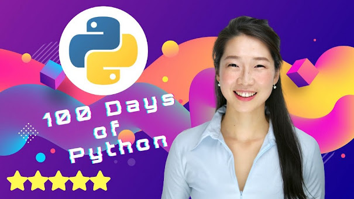

# #100dayspython
My Projecs and python files from: 100 Days of Code: The Complete Python Pro Bootcamp for 2023  
https://www.udemy.com/course/100-days-of-code  

# Completed so far

+ Day 01 = Inputs
+ Day 02 = Data-types
+ Day 03 = If statements
+ Day 04 = Random numbers & lists
+ Day 05 = Loops: For & While
+ Day 06 = Functions
+ Day 07 = Project: Hangman app
+ Day 08 = Functions - Inputs
+ Day 09 = Dictionaries
+ Day 10 = Functions - Outputs
+ Day 11 = Project: Blackjack app 
+ Day 12 = Global and local variable Scope. Project: number guesser
+ Day 13 = Debug
+ Day 14 = Project: Higher lower 
+ Day 15 = Project: Coffee Machine
+ Day 16 = OOP intro + Coffee Machine variation using OOP
